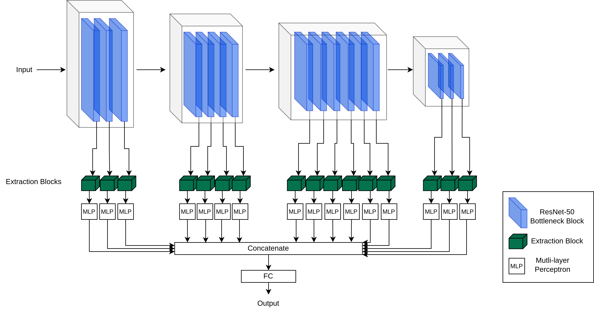

# Welcome to M<sup>2</sup>-CL

## Method
 In this work, we argue that the problems caused by
domain shift between data drawn from unknown domains can be mitigated
by utilizing multiple levels of information passed throughout a
Convolutional Neural Network, in order to derive disentangled
representations.




## Quick start
Set up:
```sh
pip install -e .
```

Download the datasets:

```sh
python3 -m domainbed.scripts.download \
       --data_dir=./domainbed/data
```

Available alogrithms in [algorithms.py](./domainbed/algorithms.py). 

Train a model:

```sh
python3 -m domainbed.scripts.train\
       --data_dir=./domainbed/data/PACS/\
       --algorithm ERM\
       --dataset PACS\
       --test_env 2
```

Train with our models:

```sh 
# Train with M2 model 
python3 -m domainbed.scripts.train\
       --data_dir=./domainbed/data/PACS/\
       --algorithm M2\
       --dataset PACS\
       --test_env 2

# Train with M2CL model 
python3 -m domainbed.scripts.train\
       --data_dir=./domainbed/data/PACS/\
       --algorithm M2CL\
       --dataset PACS\
       --test_env 2
```
